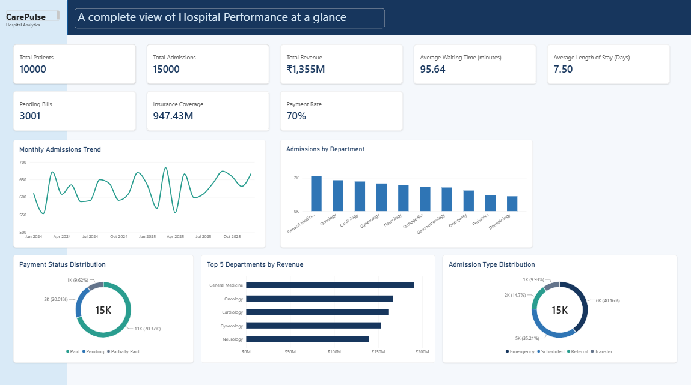

# CarePulse Analytics

## Hospital Operations Intelligence Dashboard

CarePulse Analytics is an end-to-end healthcare analytics project designed to analyze hospital operations, patient admissions, waiting times, length of stay, billing, insurance coverage, and payment status.

The project uses synthetic hospital data generated with Python and transforms it into actionable insights using SQL and Power BI.



## Project Objectives

- Analyze hospital admissions and patient activity
- Identify department-wise operational patterns
- Analyze patient waiting time and length of stay
- Evaluate hospital revenue and billing performance
- Analyze insurance coverage and payment status
- Build an interactive Power BI dashboard for decision-making

## Tech Stack

- **Python** – Data generation, cleaning and validation
- **Pandas & NumPy** – Data processing and analysis
- **Faker** – Synthetic healthcare data generation
- **MySQL** – Data storage and SQL analysis
- **SQL** – Joins, CTEs, window functions, views and aggregations
- **Power BI** – Interactive dashboard and visualization
- **DAX** – KPI calculations and measures

## Dataset

The project contains five main datasets:

- `departments.csv` – Hospital departments and bed capacity
- `doctors.csv` – Doctor information and department assignments
- `patients.csv` – Patient demographic and insurance information
- `admissions_cleaned.csv` – Admission, diagnosis, waiting time and length-of-stay information
- `billing.csv` – Treatment, medicine, room charges, insurance coverage and payment status

The data is synthetically generated and does not contain real patient information.

## Project Workflow

1. Generated synthetic hospital data using Python and Faker
2. Performed data cleaning, validation and exploratory data analysis
3. Loaded datasets into MySQL
4. Performed business-oriented SQL analysis
5. Created DAX measures in Power BI
6. Built an interactive hospital operations dashboard

## SQL Analysis

The SQL analysis covers:

- Department-wise admissions
- Average waiting time
- Top diagnoses
- Average length of stay
- Doctor admission performance
- Department revenue
- Payment status analysis
- Monthly admission trends
- Revenue ranking using CTEs and window functions
- Patients with multiple admissions
- SQL views for department performance

## Power BI Dashboard

The dashboard provides an executive overview of:

- Total Patients
- Total Admissions
- Total Revenue
- Average Waiting Time
- Average Length of Stay
- Pending Bills
- Insurance Coverage
- Payment Rate
- Monthly Admissions Trend
- Admissions by Department
- Payment Status Distribution
- Top Departments by Revenue
- Admission Type Distribution

## Project Structure

```text
carepulse_analytics/
├── data/
├── images/
├── notebooks/
├── powerbi/
├── python/
├── reports/
├── sql/
├── .gitignore
├── README.md
└── requirements.txt